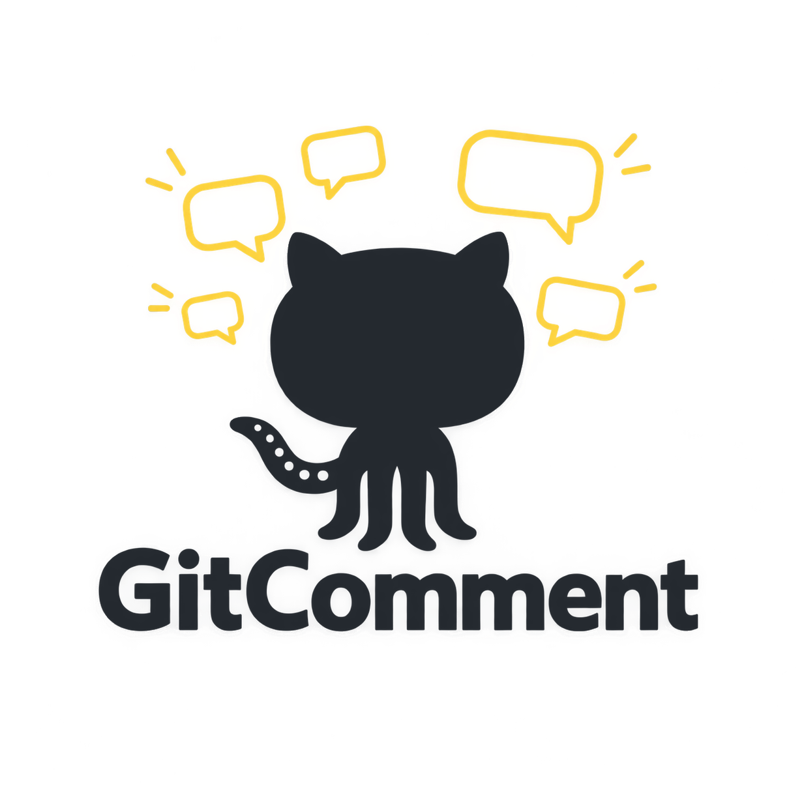
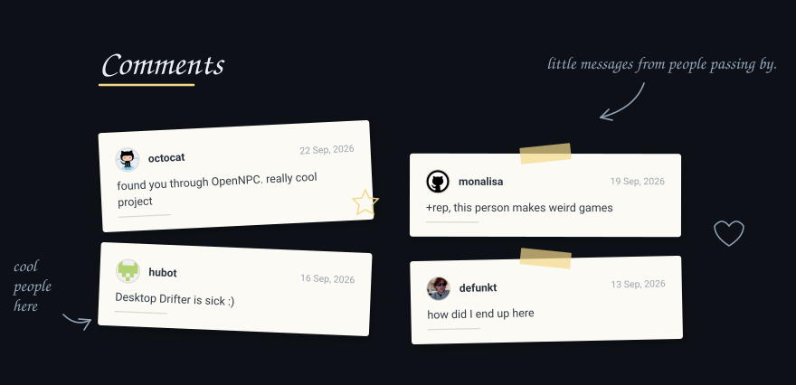
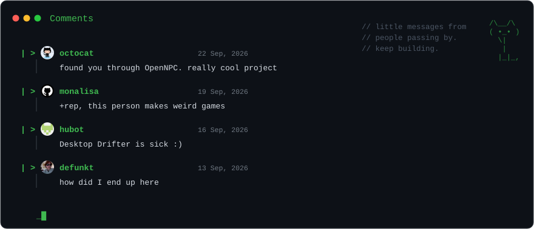
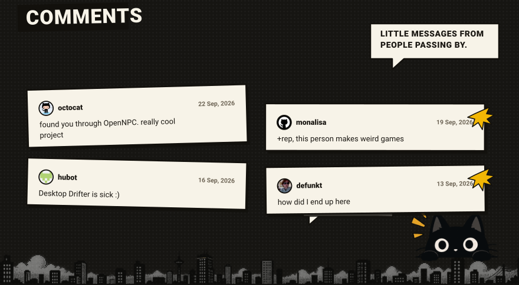
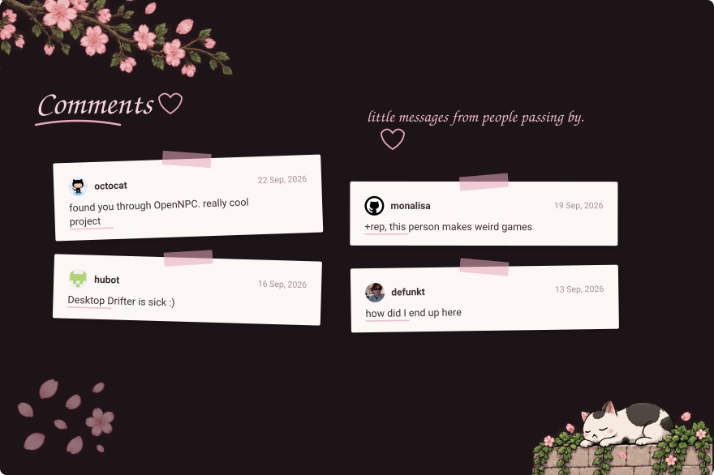
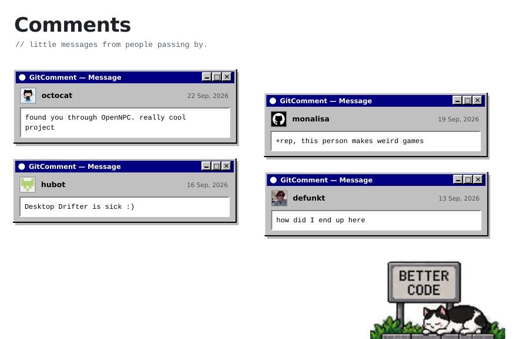

<p align="center">
  <picture>
    <source media="(prefers-color-scheme: dark)" srcset="gitcomment.png">
    
  </picture>
</p>

# GitComment

A comment section for your GitHub profile. Visitors leave you a message using
the GitHub account they already have, and it shows up in your profile README.



Comments live in a GitHub Discussion on your profile repository. When someone
posts, an Action redraws the board and commits it. No server, no database, no
signup, no account to create.

## Themes

Four of the nine, at a glance.

**notes** — the one above. Paper notes, tape, handwriting.

**dev**



**comic**



**pink**



**win95**

<picture>
  <source media="(prefers-color-scheme: dark)" srcset="assets/preview/win95-dark.svg">
  
</picture>

This one draws no background at all, so it sits directly on the page and
follows whichever GitHub theme you are using.

There are four more: `drawn`, `cozy`, `steam` and `minimal`. Those are plain
README HTML rather than images, so every username in them stays clickable.

### Changing theme

Edit `.github/gitcomment.yml` in your profile repository:

```yaml
theme: dev
variant: dark
```

Commit it, then run the workflow once from the Actions tab. That's the whole
process.

`theme` — `notes` `dev` `pink` `comic` `win95` `drawn` `cozy` `steam` `minimal`

`variant` — `dark` `light` `transparent`

`transparent` draws no background and follows whichever GitHub theme the
visitor is using. The four HTML themes ignore `variant`.

All values are lowercase. A wrong one fails the run with a message naming the
valid options, and leaves your README untouched.

## What it does

- Shows the newest few comments; the rest stay in the Discussion
- Real avatars and profile links
- Nine themes, three variants
- Hide or delete a comment and it disappears on the next run
- Blocklist, and an approval mode where nothing appears until you react to it
- Escapes everything a commenter writes, so nobody can inject markup

## Setup

**1.** Enable Discussions on your profile repository — Settings, Features.

**2.** Create one Discussion for the comments. Note its number from the URL.

**3.** Add these two lines to your README where you want the board:

```
<!-- GITCOMMENT:START -->
<!-- GITCOMMENT:END -->
```

**4.** Add `.github/workflows/comments.yml`:

```yaml
name: comments

on:
  discussion_comment:
    types: [created, edited, deleted]
  workflow_dispatch:

concurrency:
  group: comments
  cancel-in-progress: false

jobs:
  update:
    runs-on: ubuntu-latest
    permissions:
      contents: write
      discussions: read
    steps:
      - uses: LISK819129/GitComment@v1
        with:
          discussion-number: 1
```

It has to be on your default branch — GitHub only fires `discussion_comment`
for workflows that live there.

**5.** Actions tab, run it once by hand. Done.

No `actions/checkout` step. The Action reads and writes over the API, which
also means two people commenting at the same moment can't clobber each other.

## Config

All optional, at `.github/gitcomment.yml`:

```yaml
title: "Comments"
subtitle: "little messages from people passing by."

theme: notes
variant: dark

max_comments: 6
message_max_length: 240

show_avatar: true
show_date: true

moderation: automatic
blocked_users: []
```

`max_comments` is how many are drawn, not how many are kept. It defaults to
**5** and can be anything from **1 to 25**. Only that many of the newest
comments appear on the board; everything older stays in the Discussion behind
the `older messages` link, and nothing is ever deleted.

A README cannot scroll, so keeping this number small is the point. Past about
10 the board gets tall enough to push the rest of your profile off the screen.

Set `moderation: approved` and nothing appears until you add a 👍 to the
comment yourself. Reactions, because they work from the GitHub mobile app.

## Limits worth knowing

- The drawn themes are images, so **nothing inside them is clickable** — just a
  `leave a message` link underneath. Use `drawn`, `cozy`, `steam` or `minimal`
  if you want every username to be a link to their profile.
- Avatars are copied into the image, because GitHub's image proxy blocks
  outside requests. If someone changes their picture, yours updates on the next
  comment.
- Dates are drawn when the board is rendered, which is why they're absolute
  rather than "2h ago". A picture can't tell the time.
- A README can't scroll, so GitComment doesn't fake it. Newest few, then a link
  to the rest.

## Development

```
npm install
npm test
npm run build
```

`npm run try -- <owner>/<repo> <discussion> ` renders every theme against a real
Discussion without writing anything, then `npm run serve` to look at them.

`dist/index.js` is committed because GitHub Actions runs it directly.

## Credits

Handwriting is
[Caveat](https://fonts.google.com/specimen/Caveat), SIL Open Font License.

## License

MIT
